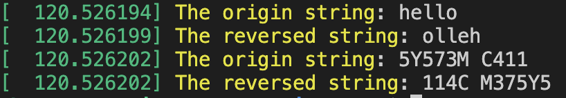
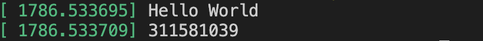

[Assignment 1: Compiling Linux Kernel and Adding Custom System Calls](https://hackmd.io/UJE-W1n9QIu0yPRa3GM8qA?view)

### 解壓縮&建資料夾
```cmd
$  tar xvf linux-5.19.12.tar.xz

$  cd linux-5.19.12

$  mkdir custom_syscall && cd custom_syscall

$  vim hello.c 
    
$  vim revstr
    
$  vim Makefile
```
### 編譯 system call function 
- Makefile (~/linux-5.19.12/custom_syscall)
    ```
    obj-y := hello.o
    obj-y += revstr.o
    ```
- Makefile (~/linux-5.19.12/)
    - 加入 `core-y		+= custom_syscall/`
    ```
    ifeq ($(KBUILD_EXTMOD),)
    # Objects we will link into vmlinux / subdirs we need to visit
    core-y		:= init/ usr/ arch/$(SRCARCH)/
    core-y		+= custom_syscall/
    drivers-y	:= drivers/ sound/
    drivers-$(CONFIG_SAMPLES) += samples/
    drivers-$(CONFIG_NET) += net/
    drivers-y	+= virt/
    libs-y		:= lib/
    endif # KBUILD_EXTMOD
    ```
    - **Note**: `KBUILD_EXTMOD` 主要用於指定 External Modules 的源代碼所在的目錄。構建系統將會進入這個目錄，並執行相應的編譯操作。通常是由第三方或用戶編寫的Modules，用於擴展Kernel的功能或添加新的驅動程序。

### 修改syscall table in 
- 產生編譯時使用的系統呼叫表（system call table） (~/arch/x86/entry/syscalls/syscall_64.tbl)
    ```tbl
    ...
    451 common hello sys_hello //add
    452 common revstr sys_revstr //add
    ```
- 新增system call heaser file (~/include/linux/syscalls.h)
    - system call function的定義
    ```c
    ...
    /* custom system call*/
    asmlinkage long sys_hello(void); //add
    asmlinkage long sys_revstr(int len, const char __user * str); //add
    #endif
    ```
### 編譯 Kernel
``` cmd
$  make -j4 && make modules_install -j4 && make install -j4
```

### 執行結果
執行main function ，使用 `sudo dmesg`
- `./hello`
    
- `./revstr`
    

